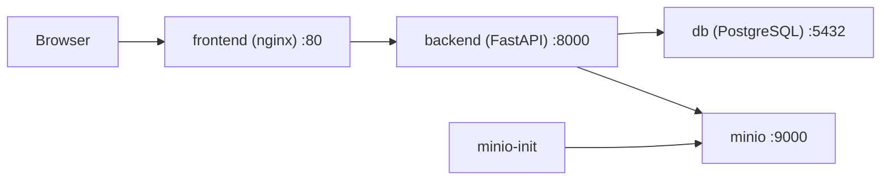

# Containerization and Deployment

## Service architecture

- `frontend`: SPA bundle served by `nginx`, also acts as the reverse proxy for `/api/*` and `/health/*`.
- `backend`: FastAPI application with OCR, authentication, barcode lookup and scan history.
- `db`: PostgreSQL for persistent relational data.
- `minio`: object storage for uploaded scan images.
- `minio-init`: one-shot bootstrap container that creates the bucket and enables read access for stored objects.

## Network scheme

All containers run in the private bridge network `app_net`. Only ports `80`, `8000`, `5432`, `9000` and `9001` are published for local development and diagnostics.

## Reproducible local start

1. Copy [.env.example](C:/Users/Alina/food-allergy-detector/.env.example) to `.env` and replace secrets.
2. Run `docker compose up --build`.
3. Open `http://localhost`.
4. Check service health:
   - frontend: `http://localhost/healthz`
   - backend live: `http://localhost/health/live`
   - backend ready: `http://localhost/health/ready`
   - MinIO console: `http://localhost:9001`

## Resilience and safety

- Secrets are moved to environment variables and `.env*` files are ignored by git except examples.
- `depends_on` with health checks blocks startup until PostgreSQL and MinIO are ready.
- Backend startup retries DB and storage connectivity before serving traffic.
- `restart: unless-stopped` restores long-running services after a crash.
- MinIO bucket bootstrap is idempotent and safe to rerun.
- If schema initialization fails, backend stays unhealthy and does not accept traffic.
- If Open Food Facts is unavailable, only barcode lookup fails; auth, profile and history remain available.

## CI/CD flow

- Workflow file: [.github/workflows/ci-cd.yml](C:/Users/Alina/food-allergy-detector/.github/workflows/ci-cd.yml)
- On every push and pull request:
  - backend lint: `ruff check backend`
  - backend tests: `pytest backend/tests -q`
  - frontend lint: `npm run lint`
  - frontend tests: `npm run test:run`
  - frontend build: `npm run build`
  - container build: `docker compose build`
- On push to `main` or `master`, after successful checks, GitHub Actions deploys to the target host over SSH and runs `docker compose up -d --build --remove-orphans`.

## Failure scenarios covered

- Backend crash: container restarts automatically.
- DB unavailable on startup: backend waits and retries before failing readiness.
- MinIO unavailable: backend stays unhealthy, preventing broken traffic routing.
- Object storage bootstrap rerun: `minio-init` is idempotent.
- Failed schema creation: backend startup fails fast and deployment does not become healthy.
